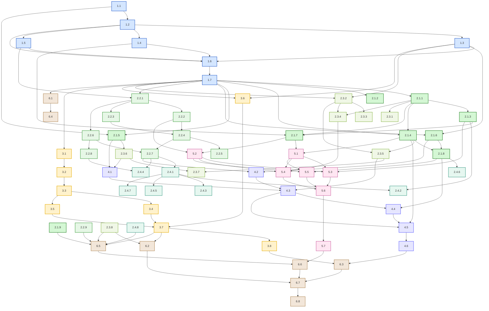

Once the POS is approved, the Planning phase can start.

## Joint Project Planning Sessions

Joint Project Planning Sessions (JPPSs) are scheduled. The entire development team and project manager will partecipate to these meetings.

The PM schedules and organizes the meetings deciding:

- Attendees:
    - The entire development team (14 members), Finance Manager, Customer Experience Analyst and the PM himself
- Facilities:
    - The meeting room in OpenML offices is spacious enough for the JPPSs to take place
- Equipment:
    - The meeting room provides a wide round table with enough seats for all attendees
    - Office laptops and pen and paper will be provided

### Agenda

The following Agenda will be carried out throughout the JPPSs

1. Introduction
    - Introduction of attendees
    - Introduction of project
    - Introduction of the agenda
2. Project Analysis
    - Develop of Work Breakdown Structure
    - Construct of Dependency Diagram
    - Construct of Network Diagram
    - Schedule Compression
3. Risk and Resource Planning
    - Risk Assessment
    - Resource Allocation
4. Documentation
    - Draft of Project Definition Statement
    - Writing of Project Proposal
    - Summarise Project Notebook

### Deliverables

The deliverables expected to be produced at the end of the meetings are:

- Project Definition Statement (PDS)
- Work Breakdown Structure (WBS)
- Required Resources
- Resource Allocation
- Estimate Activity Duration
- Project Network Schedule
- Activity Scheduling
- Project Notebook
- Project Proposal

## Work Breakdown Structure

Activities are constructed to represent the work to be done to satisfy the requirements expressed by the user stories.

Since the relationship between user stories and activities is non trivial Requirements Traceability Matrixes (RTM) are used to highlight these relationships.

Since some activities are totally fully they do not have a user story related.

### Research & Design

| ID | Activity | Related User Stories |
|----|----------|----------------------|
| 1.1 | Study and interpret the Secure Average Computation algorithm (Wink et al., 2021) | 3.3.2.1 |
| 1.2 | Design federated architecture (server–peer topology, communication flow) | 3.3.1.2 |
| 1.3 | Define security and encryption mechanisms for peer communication | 3.2.1.1, 3.2.1.2, 3.2.1.3 |
| 1.4 | Define API specifications and endpoints | 1.1.3.1, 3.1.1.3, 3.1.3.2, 3.1.4.4, 3.3.1.6, 3.3.3.4, 4.2.1.1 |
| 1.5 | Design data schema and metadata format for federated datasets | 2.1.1.1, 2.1.1.2, 2.1.3.2 |
| 1.6 | Produce software architecture documentation and design diagrams | |
| 1.7 | Validate design through technical review | |

### Core Framework Development

#### Core

| ID | Activity | Related User Stories |
|----|----------|----------------------|
| 2.1.1 | Implement peer registration and authentication subsystem | 1.2.2.1, 3.1.1.1, 3.1.1.2, 3.1.1.3, 3.2.1.5 |
| 2.1.2 | Develop data preprocessing interface and function library | 2.1.2.1, 2.1.2.2, 2.1.2.3 |
| 2.1.3 | Implement role and permission management | 3.1.2.1, 3.1.2.2, 3.1.2.3, 3.1.3.1, 3.1.3.2, 3.1.3.3, 4.1.2.1, 4.1.2.2, 4.1.2.3, 4.1.2.4, 4.1.2.5 |
| 2.1.4 | Implement federated orchestration service (task coordination, scheduling) | 3.3.1.1, 3.3.1.2, 3.3.1.3, 3.3.1.4, 3.3.1.5 |
| 2.1.5 | Develop Secure Average Computation module | 3.3.2.2 |
| 2.1.6 | Implement communication protocol for distributed training | 3.2.2.1, 3.2.2.2, 3.2.2.3, 3.2.2.4, 3.2.2.5, 3.2.2.6 |
| 2.1.7 | Develop API endpoints for peer and admin operations | 1.1.3.1, 2.1.1.3, 2.3.1.3, 2.3.2.3, 2.3.3.4, 3.3.3.4, 4.2.1.1, 4.2.1.2, 4.2.1.4 |
| 2.1.8 | Integrate monitoring and logging capabilities | 1.3.3.2, 2.1.3.3, 3.2.1.6, 3.2.1.7, 3.2.4.1, 3.2.4.2, 3.2.4.3, 3.2.4.4, 3.2.4.5, 3.2.4.6, 3.3.3.5, 4.1.2.2, 4.1.3.5, 4.2.1.5, 4.2.3.5 |
| 2.1.9 | Conduct unit and integration testing for modules | |

#### Model Definition & Configuration

| ID | Activity | Related User Stories |
|----|----------|----------------------|
| 2.2.1 | Design and implement input schema definition system | 2.1.1.1, 2.1.1.2, 2.1.1.3 |
| 2.2.2 | Create layer configuration interface (UI and API) | 2.2.1.1, 2.2.1.2, 2.2.1.3 |
| 2.2.3 | Build supported architectures library and templates | 2.2.2.1, 2.2.2.2, 2.2.2.3 |
| 2.2.4 | Implement model architecture validation system | 2.2.3.1, 2.2.3.2, 2.2.3.3 |
| 2.2.5 | Develop custom layer support with sandboxing | 2.2.4.1, 2.2.4.2, 2.2.4.3, 3.3.2.4, 3.3.2.5 |
| 2.2.6 | Design and implement output schema definition system | 2.3.1.1, 2.3.1.2, 2.3.1.3 |
| 2.2.7 | Develop model export and serialization capabilities | 2.3.2.1, 2.3.2.2, 2.3.2.3, 4.2.2.1, 4.2.2.2 |
| 2.2.8 | Implement evaluation and metrics interface | 2.3.3.1, 2.3.3.2, 2.3.3.3, 2.3.3.4 |
| 2.2.9 | Conduct unit and integration testing for modules | |

#### Federation Management & Security

| ID | Activity | Related User Stories |
|----|----------|----------------------|
| 2.3.1 | Implement membership lifecycle management system | 3.1.4.1, 3.1.4.2, 3.1.4.3, 3.1.4.4 |
| 2.3.2 | Develop secure communication layer with TLS/mTLS | 3.2.1.1, 3.2.1.2, 3.2.1.3, 3.2.1.4 |
| 2.3.3 | Implement certificate management and auto-renewal | 3.2.1.4 |
| 2.3.4 | Build authentication and identity management system | 3.2.1.5, 3.2.1.6, 3.2.1.7 |
| 2.3.5 | Develop fault tolerance and retry mechanisms | 3.2.3.1, 3.2.3.2, 3.2.3.3, 3.2.3.4, 3.2.3.5, 3.2.3.6 |
| 2.3.6 | Implement aggregation strategy framework | 3.3.2.1, 3.3.2.2, 3.3.2.3, 3.3.2.4, 3.3.2.5, 3.3.2.6 |
| 2.3.7 | Develop training error handling and recovery system | 3.3.4.1, 3.3.4.2, 3.3.4.3, 3.3.4.4, 3.3.4.5, 3.3.4.6 |
| 2.3.8 | Conduct unit and integration testing for modules | |

#### Model Storage & Inference

| ID | Activity | Related User Stories |
|----|----------|----------------------|
| 2.4.1 | Implement model version control system | 4.1.1.1, 4.1.1.2, 4.1.1.3, 4.1.1.4, 4.1.1.5 |
| 2.4.2 | Develop model access control and permission system | 4.1.2.1, 4.1.2.2, 4.1.2.3, 4.1.2.4, 4.1.2.5 |
| 2.4.3 | Implement model integrity verification system | 4.1.3.1, 4.1.3.2, 4.1.3.3, 4.1.3.4, 4.1.3.5 |
| 2.4.4 | Build inference API service with batch processing | 4.2.1.1, 4.2.1.2, 4.2.1.3, 4.2.1.4, 4.2.1.5, 4.2.1.6 |
| 2.4.5 | Develop edge deployment and optimization system | 4.2.2.1, 4.2.2.2, 4.2.2.3, 4.2.2.4, 4.2.2.5, 4.2.2.6 |
| 2.4.6 | Implement performance monitoring and analytics | 4.2.3.1, 4.2.3.2, 4.2.3.3, 4.2.3.4, 4.2.3.5, 4.2.3.6 |
| 2.4.7 | Develop model update and deployment orchestration | 4.2.4.1, 4.2.4.2, 4.2.4.3, 4.2.4.4, 4.2.4.5, 4.2.4.6 |
| 2.4.8 | Conduct unit and integration testing for modules | |

### Infrastructure & Deployment

| ID | Activity | Related User Stories |
|----|----------|----------------------|
| 3.1 | Configure development and testing environments | 1.2.1.3 |
| 3.2 | Implement containerization (e.g., Docker) for peer and server components | 1.1.2.2 |
| 3.3 | Set up orchestration (Kubernetes or similar) | 1.1.2.2, 4.2.1.3, 4.2.4.1 |
| 3.4 | Create CI/CD pipelines for automated builds and deployment | 1.2.1.3 |
| 3.5 | Configure cloud infrastructure for distributed experiments | |
| 3.6 | Establish data privacy and network security policies | 3.2.1.3 |
| 3.7 | Deploy framework to production (SAAS hosting) | 1.2.1.1, 1.2.1.2, 1.2.1.3, 3.1.1.2 |
| 3.8 | Conduct scalability and performance tests | 4.2.1.3, 4.2.1.6 |

### Federated Learning Integration

| ID | Activity | Related User Stories |
|----|----------|----------------------|
| 4.1 | Implement model aggregation logic using Secure Average Computation | 3.3.2.1, 3.3.2.2, 3.3.2.3 |
| 4.2 | Define model update serialization and exchange protocol | 3.2.2.1, 3.2.2.2, 3.2.2.3 |
| 4.3 | Handle asynchronous peer updates and dropout resilience | 3.2.3.1, 3.2.3.2, 3.2.3.3, 3.2.3.4, 3.2.3.5, 3.2.3.6, 3.3.4.1, 3.3.4.3, 3.3.4.4 |
| 4.4 | Implement audit trail and logging of training rounds | 3.1.4.3, 3.2.4.1, 3.2.4.2, 3.3.3.5 |
| 4.5 | Integrate algorithm with orchestration and monitoring services | 3.3.1.5, 3.3.3.1, 3.3.3.2, 3.3.3.3 |
| 4.6 | Validate model performance and convergence under federation | 1.3.3.1, 3.3.4.6 |

### User Interface & Experience

| ID | Activity | Related User Stories |
|----|----------|----------------------|
| 5.1 | Design admin dashboard (federation overview, peer management) | 1.1.1.2, 1.2.2.3, 1.3.1.2, 1.3.2.3, 3.1.1.1, 3.1.2.1, 3.1.4.1, 3.2.4.6, 3.3.1.1, 3.3.1.5, 3.3.3.3, 4.1.1.4, 4.2.3.2, 4.2.3.4 |
| 5.2 | Design peer organization dashboard (local training, participation status) | 1.3.3.1, 2.3.1.2, 2.3.3.3, 3.1.2.2, 3.1.4.2, 3.3.3.2, 4.1.1.1, 4.1.1.2 |
| 5.3 | Implement role-based access controls in the UI | 3.1.2.1, 3.1.2.2, 3.1.3.1, 4.1.2.1, 4.1.2.3 |
| 5.4 | Integrate credential management and registration flows | 1.3.1.1, 3.1.1.2 |
| 5.5 | Add notifications for federation events and status updates | 1.2.2.3, 3.3.3.6, 4.2.3.3 |
| 5.6 | Conduct usability testing and collect feedback | 1.1.1.1, 1.3.1.3 |
| 5.7 | Implement help, documentation, and onboarding pages | 1.1.1.1, 1.1.2.1, 1.1.3.1, 1.1.3.2, 1.3.1.1 |

### Quality Assurance & Documentation

| ID | Activity | Related User Stories |
|----|----------|----------------------|
| 6.1 | Develop comprehensive test plan (unit, integration, system, acceptance) | 1.2.1.3, 2.2.3.2, 3.3.2.6, 4.2.4.4 |
| 6.2 | Perform security and compliance testing | 1.2.2.1, 2.2.4.2, 3.1.3.3, 3.1.4.3, 3.2.4.1, 4.1.1.5, 4.1.3.1, 4.2.1.4, 4.2.2.4, 4.2.4.5 |
| 6.3 | Conduct performance benchmarking | 2.2.4.3, 3.2.2.4, 3.2.2.5, 4.2.1.3, 4.2.3.1 |
| 6.4 | Maintain traceability between user stories and test cases | 1.1.1.3, 1.3.3.3 |
| 6.5 | Prepare technical documentation (API docs, deployment guide) | 1.1.2.2, 1.1.2.3, 1.1.3.1, 1.3.2.2, 3.3.2.5 |
| 6.6 | Write user documentation and quick-start manuals | 1.1.2.1, 1.1.3.2, 1.1.3.3, 1.2.1.1, 1.2.1.2 |
| 6.7 | Conduct final validation and acceptance testing | 1.2.2.2 |
| 6.8 | Prepare lessons learned and project closure report | |

## Resource Allocation

### Human Resources

| Role | Count | Primary Focus Areas |
|------|-------|---------------------|
| Project Managers | 1 | Overall coordination, timeline, budget |
| ML Research Leads | 2 | Research & Design, Algorithm validation |
| Senior Backend Engineers | 2 | Core Framework, Federation Management |
| DevOps Engineers | 2 | Infrastructure & Deployment |
| ML Engineers | 2 | Federated Learning Integration, Model Definition |
| Frontend Engineers | 2 | User Interface & Experience |
| QA Engineers | 2 | Quality Assurance & Documentation |
| Full-stack Engineers | 2 | Model Storage & Inference |

Most roles are covered by at least two employees to enable code review sessions and limit the risk of optimistic predictions.

### Infrastructure & Tools

| Category | Resources | Purpose |
|----------|-----------|---------|
| Development | 3x AWS EC2 instances, GitHub Teams | Core development and version control |
| Testing | Kubernetes cluster, 5x test peer nodes | Integration and federation testing |
| Staging | Scaled-down production environment | Pre-production validation |
| Production | Multi-region Kubernetes, 50+ peer capacity | SAAS hosting and client deployments |
| Monitoring | Prometheus | Performance and security monitoring |

Known tools were preferred to limit employee training necessity.

### Budget Allocation

| Area | Percentage | Description |
|------|------------|-------------|
| Personnel | 65% | Salaries for 15-person team |
| Infrastructure | 20% | Cloud services, development tools |
| Security & Compliance | 10% | Audits, penetration testing, certifications |
| Contingency | 5% | Unplanned expenses, scope changes |

Percentage estimations have been aided by past project experience.

## Activity Durations

Given the allocated resources, the following activity durations have been considered.

### Research & Design

| ID | Activity | Duration Estimate |
|----|----------|------------------|
| 1.1 | Study and interpret the Secure Average Computation algorithm (Wink et al., 2021) | 3 weeks |
| 1.2 | Design federated architecture | 2 weeks |
| 1.3 | Define security and encryption mechanisms for peer communication | 2 weeks |
| 1.4 | Define API specifications and endpoints | 3 weeks |
| 1.5 | Design data schema and metadata format for federated datasets | 2 weeks |
| 1.6 | Produce software architecture documentation and design diagrams | 1 week |
| 1.7 | Validate design through technical review | 1 week |

### Core Framework Development

#### Core

| ID | Activity | Duration Estimate |
|----|----------|------------------|
| 2.1.1 | Implement peer registration and authentication subsystem | 4 weeks |
| 2.1.2 | Develop data preprocessing interface and function library | 3 weeks |
| 2.1.3 | Implement role and permission management | 5 weeks |
| 2.1.4 | Implement federated orchestration service (task coordination, scheduling) | 6 weeks |
| 2.1.5 | Develop Secure Average Computation module | 4 weeks |
| 2.1.6 | Implement communication protocol for distributed training | 5 weeks |
| 2.1.7 | Develop API endpoints for peer and admin operations | 6 weeks |
| 2.1.8 | Integrate monitoring and logging capabilities | 4 weeks |
| 2.1.9 | Conduct unit and integration testing for modules | 3 weeks |

#### Model Definition & Configuration

| ID | Activity | Duration Estimate |
|----|----------|------------------|
| 2.2.1 | Design and implement input schema definition system | 3 weeks |
| 2.2.2 | Create layer configuration interface (UI and API) | 4 weeks |
| 2.2.3 | Build supported architectures library and templates | 5 weeks |
| 2.2.4 | Implement model architecture validation system | 3 weeks |
| 2.2.5 | Develop custom layer support with sandboxing | 4 weeks |
| 2.2.6 | Design and implement output schema definition system | 2 weeks |
| 2.2.7 | Develop model export and serialization capabilities | 4 weeks |
| 2.2.8 | Implement evaluation and metrics interface | 3 weeks |
| 2.2.9 | Conduct unit and integration testing for modules | 2 weeks |

#### Federation Management & Security

| ID | Activity | Duration Estimate |
|----|----------|------------------|
| 2.3.1 | Implement membership lifecycle management system | 3 weeks |
| 2.3.2 | Develop secure communication layer with TLS/mTLS | 4 weeks |
| 2.3.3 | Implement certificate management and auto-renewal | 2 weeks |
| 2.3.4 | Build authentication and identity management system | 5 weeks |
| 2.3.5 | Develop fault tolerance and retry mechanisms | 4 weeks |
| 2.3.6 | Implement aggregation strategy framework | 5 weeks |
| 2.3.7 | Develop training error handling and recovery system | 4 weeks |
| 2.3.8 | Conduct unit and integration testing for modules | 2 weeks |

#### Model Storage & Inference

| ID | Activity | Duration Estimate |
|----|----------|------------------|
| 2.4.1 | Implement model version control system | 4 weeks |
| 2.4.2 | Develop model access control and permission system | 3 weeks |
| 2.4.3 | Implement model integrity verification system | 3 weeks |
| 2.4.4 | Build inference API service with batch processing | 6 weeks |
| 2.4.5 | Develop edge deployment and optimization system | 5 weeks |
| 2.4.6 | Implement performance monitoring and analytics | 4 weeks |
| 2.4.7 | Develop model update and deployment orchestration | 5 weeks |
| 2.4.8 | Conduct unit and integration testing for modules | 3 weeks |

### Infrastructure & Deployment

| ID | Activity | Duration Estimate |
|----|----------|------------------|
| 3.1 | Configure development and testing environments | 2 weeks |
| 3.2 | Implement containerization (e.g., Docker) for peer and server components | 3 weeks |
| 3.3 | Set up orchestration (Kubernetes or similar) | 4 weeks |
| 3.4 | Create CI/CD pipelines for automated builds and deployment | 3 weeks |
| 3.5 | Configure cloud infrastructure for distributed experiments | 2 weeks |
| 3.6 | Establish data privacy and network security policies | 1 week |
| 3.7 | Deploy framework to production (SAAS hosting) | 2 weeks |
| 3.8 | Conduct scalability and performance tests | 3 weeks |

### Federated Learning Integration

| ID | Activity | Duration Estimate |
|----|----------|------------------|
| 4.1 | Implement model aggregation logic using Secure Average Computation | 4 weeks |
| 4.2 | Define model update serialization and exchange protocol | 3 weeks |
| 4.3 | Handle asynchronous peer updates and dropout resilience | 5 weeks |
| 4.4 | Implement audit trail and logging of training rounds | 2 weeks |
| 4.5 | Integrate algorithm with orchestration and monitoring services | 4 weeks |
| 4.6 | Validate model performance and convergence under federation | 3 weeks |

### User Interface & Experience

| ID | Activity | Duration Estimate |
|----|----------|------------------|
| 5.1 | Design admin dashboard (federation overview, peer management) | 6 weeks |
| 5.2 | Design peer organization dashboard (local training, participation status) | 5 weeks |
| 5.3 | Implement role-based access controls in the UI | 3 weeks |
| 5.4 | Integrate credential management and registration flows | 2 weeks |
| 5.5 | Add notifications for federation events and status updates | 2 weeks |
| 5.6 | Conduct usability testing and collect feedback | 2 weeks |
| 5.7 | Implement help, documentation, and onboarding pages | 3 weeks |

### Quality Assurance & Documentation

| ID | Activity | Duration Estimate |
|----|----------|------------------|
| 6.1 | Develop comprehensive test plan (unit, integration, system, acceptance) | 2 weeks |
| 6.2 | Perform security and compliance testing | 4 weeks |
| 6.3 | Conduct performance benchmarking | 3 weeks |
| 6.4 | Maintain traceability between user stories and test cases | 1 week |
| 6.5 | Prepare technical documentation (API docs, deployment guide) | 4 weeks |
| 6.6 | Write user documentation and quick-start manuals | 3 weeks |
| 6.7 | Conduct final validation and acceptance testing | 2 weeks |
| 6.8 | Prepare lessons learned and project closure report | 1 week |

## Project Network

Dependencies between activities where identified:

### Research & Design

| ID | Activity | Dependencies |
|----|----------|--------------|
| 1.1 | Study and interpret the Secure Average Computation algorithm | - |
| 1.2 | Design federated architecture | 1.1 |
| 1.3 | Define security and encryption mechanisms for peer communication | 1.2 |
| 1.4 | Define API specifications and endpoints | 1.2 |
| 1.5 | Design data schema and metadata format for federated datasets | 1.2 |
| 1.6 | Produce software architecture documentation and design diagrams | 1.3, 1.4, 1.5 |
| 1.7 | Validate design through technical review | 1.6 |

### Core Framework Development

#### Core

| ID | Activity | Dependencies |
|----|----------|--------------|
| 2.1.1 | Implement peer registration and authentication subsystem | 6.4 |
| 2.1.2 | Develop data preprocessing interface and function library | 6.4 |
| 2.1.3 | Implement role and permission management | 2.1.1 |
| 2.1.4 | Implement federated orchestration service | 2.1.1 |
| 2.1.5 | Develop Secure Average Computation module | 6.4 |
| 2.1.6 | Implement communication protocol for distributed training | 6.4 |
| 2.1.7 | Develop API endpoints for peer and admin operations | 2.1.3 |
| 2.1.8 | Integrate monitoring and logging capabilities | 2.1.4, 2.1.6 |
| 2.1.9 | Conduct unit and integration testing for modules | 2.1.2, 2.1.3, 2.1.5, 2.1.8 |

#### Model Definition & Configuration

| ID | Activity | Dependencies |
|----|----------|--------------|
| 2.2.1 | Design and implement input schema definition system | 6.4 |
| 2.2.2 | Create layer configuration interface (UI and API) | 2.2.1 |
| 2.2.3 | Build supported architectures library and templates | 2.2.1 |
| 2.2.4 | Implement model architecture validation system | 2.2.2, 2.2.3 |
| 2.2.5 | Develop custom layer support with sandboxing | 2.2.4 |
| 2.2.6 | Design and implement output schema definition system | 2.2.1 |
| 2.2.7 | Develop model export and serialization capabilities | 2.2.4, 2.2.6 |
| 2.2.8 | Implement evaluation and metrics interface | 2.2.6 |
| 2.2.9 | Conduct unit and integration testing for modules | 2.2.5, 2.2.7, 2.2.8 |

#### Federation Management & Security

| ID | Activity | Dependencies |
|----|----------|--------------|
| 2.3.1 | Implement membership lifecycle management system | 2.1.1 |
| 2.3.2 | Develop secure communication layer with TLS/mTLS | 6.4 |
| 2.3.3 | Implement certificate management and auto-renewal | 2.3.2 |
| 2.3.4 | Build authentication and identity management system | 2.1.1, 2.3.2 |
| 2.3.5 | Develop fault tolerance and retry mechanisms | 2.1.4, 2.3.2 |
| 2.3.6 | Implement aggregation strategy framework | 2.1.5 |
| 2.3.7 | Develop training error handling and recovery system | 2.3.5, 2.3.6 |
| 2.3.8 | Conduct unit and integration testing for modules | 2.3.1, 2.3.3, 2.3.4, 2.3.7 |

#### Model Storage & Inference

| ID | Activity | Dependencies |
|----|----------|--------------|
| 2.4.1 | Implement model version control system | 2.2.7 |
| 2.4.2 | Develop model access control and permission system | 2.1.3, 2.4.1 |
| 2.4.3 | Implement model integrity verification system | 2.4.1 |
| 2.4.4 | Build inference API service with batch processing | 2.2.7, 2.2.8 |
| 2.4.5 | Develop edge deployment and optimization system | 2.4.1 |
| 2.4.6 | Implement performance monitoring and analytics | 2.1.8, 2.4.4 |
| 2.4.7 | Develop model update and deployment orchestration | 2.4.1, 2.4.5 |
| 2.4.8 | Conduct unit and integration testing for modules | 2.4.2, 2.4.3, 2.4.6, 2.4.7 |

### Infrastructure & Deployment

| ID | Activity | Dependencies |
|----|----------|--------------|
| 3.1 | Configure development and testing environments | 6.4 |
| 3.2 | Implement containerization for peer and server components | 3.1 |
| 3.3 | Set up orchestration (Kubernetes or similar) | 3.2 |
| 3.4 | Create CI/CD pipelines for automated builds and deployment | 3.3 |
| 3.5 | Configure cloud infrastructure for distributed experiments | 3.3 |
| 3.6 | Establish data privacy and network security policies | 6.4 |
| 3.7 | Deploy framework to production (SAAS hosting) | 3.4, 3.5, 3.6 |
| 3.8 | Conduct scalability and performance tests | 3.7 |

### Federated Learning Integration

| ID | Activity | Dependencies |
|----|----------|--------------|
| 4.1 | Implement model aggregation logic using Secure Average Computation | 2.1.5, 2.3.6 |
| 4.2 | Define model update serialization and exchange protocol | 2.2.7, 2.1.6 |
| 4.3 | Handle asynchronous peer updates and dropout resilience | 2.3.5, 4.1, 4.2 |
| 4.4 | Implement audit trail and logging of training rounds | 2.1.8, 4.3 |
| 4.5 | Integrate algorithm with orchestration and monitoring services | 2.1.4, 4.4 |
| 4.6 | Validate model performance and convergence under federation | 4.5 |

### User Interface & Experience

| ID | Activity | Dependencies |
|----|----------|--------------|
| 5.1 | Design admin dashboard (federation overview, peer management) | 2.1.4, 2.1.7 |
| 5.2 | Design peer organization dashboard (local training, participation status) | 2.1.7, 2.2.2 |
| 5.3 | Implement role-based access controls in the UI | 2.1.3, 5.1, 5.2 |
| 5.4 | Integrate credential management and registration flows | 2.3.4, 5.1, 5.2 |
| 5.5 | Add notifications for federation events and status updates | 2.1.8, 5.1, 5.2 |
| 5.6 | Conduct usability testing and collect feedback | 5.3, 5.4, 5.5 |
| 5.7 | Implement help, documentation, and onboarding pages | 5.6 |

### Quality Assurance & Documentation

| ID | Activity | Dependencies |
|----|----------|--------------|
| 6.1 | Develop comprehensive test plan | 1.7 |
| 6.2 | Perform security and compliance testing | 2.3.8, 3.7 |
| 6.3 | Conduct performance benchmarking | 3.8, 4.6 |
| 6.4 | Maintain traceability between user stories and test cases | 6.1 |
| 6.5 | Prepare technical documentation (API docs, deployment guide) | 2.1.9, 2.2.9, 2.3.8, 2.4.8, 3.7 |
| 6.6 | Write user documentation and quick-start manuals | 5.7, 6.5 |
| 6.7 | Conduct final validation and acceptance testing | 6.2, 6.3, 6.6 |
| 6.8 | Prepare lessons learned and project closure report | 6.7 |

By considering activity dependencies and slacks the Project Network Diagram has been produced.

NOTE due to the rendering engine the graph is best seen in light mode



### Gantt

```mermaid
    gantt
```

## Iteration Planning

## Project Proposal

### Executive Summary

### Background

### Objective

### Overview of Approach

### Detailed Statements of Work

### Risk Analysis

### Time and Cost Summary

