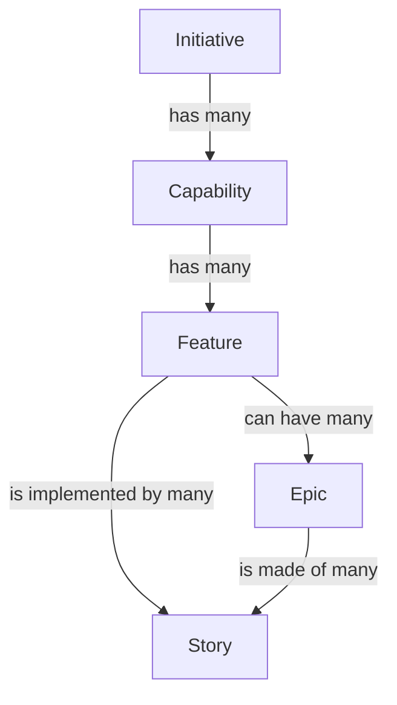
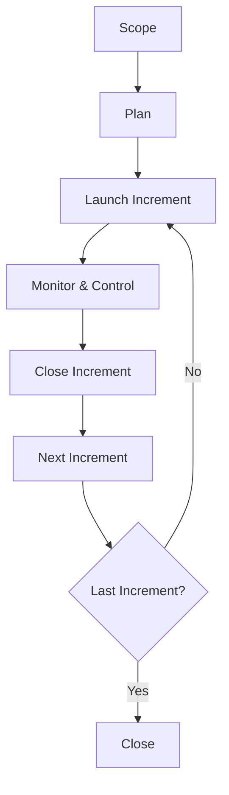

Given the project's initial informal proposal, it is clearly a 'Product Development Project' (in contrast to the more common 'Client Delivery Project'). This type of project is similar to the main product sold by OpenML to it's customers so the company is adept to it's quirks.

## Project Scoping Meetings

To kick off the Scoping Phase of the project it is crucial to arrange up Project Scoping Meetings to gather necessary information and produce initial deliverables.

Given the nature of the project there are no clients to involve in the Scoping Meetings, so the participants are 'internal' to the company.

The expected deliverables expected to be produced at the end of the meetings are:

- List of Conditions of Satisfaction (CoS)
- Requirements Definition
- Choice of PMLC Model to adopt
- Project Overview Statement (POS)

### Meetings Details

Given the high man/hour cost of meetings, two possible approaches are considered to minimize time investment:

- Many meetings with different participants, with the goal of grouping participants with similar schedules and expertise, minimizing scheduling conflicts
- Few meetings with all participants, but with a lower partecipant total, preferring representatives of groups instead of all members

Given the low personnel count of OpenML the second approach is chosen.

The following table lists the participants of the meetings and their roles.

| Name       | Role                        | Reasoning                                             |
|------------|-----------------------------|-------------------------------------------------------|
| A. Tyr     | Project Manager             | The figure selected to eventualy manage the project   |
| B. Saga    | Customer Experience Analyst | Expert representing market concerns and opinions      |
| C. Mimir   | Technical Lead              | Technician representing the eventual development team |
| D. Freyr   | Finance Manager             | Consulting on budgeting aspects of the project        |
| E. Forseti | Legal Advisor               | Ensures legal constraints are considered              |

The Project Manager (PM) will also serve as moderator/facilitator during the meetings.

Given the scope of work (pun intended) to be undertaken during the meetings an initial scheduling of 3 meetings is set, with the possibility of arranging more meetings if necessary.

### Meeting Agenda Template

To aid in the meetings' execution an agenda is used to keep track of the progress.

The following template is used to create the meeting agenda, removing items already completed in previous meetings when necessary.

- Recap of previous meeting

- Introduction of current agenda
- Introduction to the project's inception
- Introduction to project's goal/idea
- Discussion of Conditions of Satisfaction (CoS)
- Production of CoS document
- Discussion of Requirements
- Production of Requirements Definition document
- Choice of PMLC Model
- Draft Project Overview Statement

- Adjurn to next meeting

## Conditions of Satisfaction

In the creation of the CoS document, particular enphasis on the security aspects is put as it is a key feature of the Tyr Framework.

1. Quantitative
    1. Core
        1. Model convergence time to be less than 2x of the centralized baseline
        1. Maximum supported peers in a single federation to be more than 25 organizations
        1. Model to converge to baseline accuracy within less than 5x epochs, respect to the number of epochs of the baseline
    1. Security
        1. Zero raw data transmission between peers
        1. Implemented model encryption and secure aggregation protocols
        1. Multi-factor authentication and cryptographic identity verification for all peers
        1. Zero data leakage verified via privacy audit and attack simulation.
    1. Technical
        1. Client onboarding time less than 4 hours for technical team
        1. 100% of API endpoints to be documented
1. Qualitative
    1. Security
        1. Formal privacy guarantees demonstrated and documented by the research team.
        1. Comprehensive logging of all federation activities accessible to all participants
        1. Clear visibility into aggregation processes without revealing private data
        1. Framework design approved by regional legal counsels for data protection regulations
    1. User Experience
        1. Streamlined process for new organizations to join federations
        1. Intuitive interface for managing multiple federated models
        1. Real-time visibility into training progress and federation health
        1. Comprehensive guides for technical teams and business stakeholders
    1. Business Value
        1. Framework capabilities demonstrably superior to existing open-source solutions
        1. Clear path to monetization through SaaS model

## Requirements Definition

Two ways of expressing requirements are considered:

- Requirements Breakdown Structure (RBS)
- User Stories

RBS has many advantages over User Stories:

- Usually more formal and less subject to misunderstanding
- Being a more traditional approach it is better documented and partecipants might be more use to them
- Understandable hierarchical structure

Most of the strenghts of RBS are considered to be less apparent when the partecipants are entirely internal to OpenML:

- Being an 'internal project' the risk (as in the product of the probability and recovery cost) of misunderstandings is lower
- The team is used to using User Stories as many members, as the company itself, are young and adept to modern approaches
- A hierarchical structure can be imposed with little effort to User Stories too

For these reasons the User Stories apprach is chosen to represent project Requirements

### User Stories

To organizer User Stories into a hierarchical structure the following concepts are used:

#### 1. Client Onboarding and Support

##### 1.1 Documentation

###### 1.1.1 Offer Catalog

| ID | Who | What | Why |
|----|-----|------|-----|
| 1.1.1.1 | As a potential client | I want to browse a catalog of available Tyr Framework offers | So I can understand which subscription plan best fits my organization’s needs |
| 1.1.1.2 | As a sales representative | I want to update and manage the offer catalog content | So that clients always see up-to-date pricing and feature information |
| 1.1.1.3 | As a product manager | I want to track which offers receive the most interest | So that I can refine future pricing and feature bundles |

###### 1.1.2 Installation Documentation

| ID | Who | What | Why |
|----|-----|------|-----|
| 1.1.2.1 | As a new client developer | I want clear step-by-step installation guides | So that I can deploy the Tyr Framework quickly and without external help |
| 1.1.2.2 | As a DevOps engineer | I want configuration examples for different environments | So that I can integrate the framework into our existing infrastructure |
| 1.1.2.3 | As a support engineer | I want standardized installation documentation | So that I can easily help clients troubleshoot setup issues |

###### 1.1.3 Framework Documentation

| ID | Who | What | Why |
|----|-----|------|-----|
| 1.1.3.1 | As an ML engineer | I want API documentation with practical code examples | So that I can integrate the framework into my ML workflows efficiently |
| 1.1.3.2 | As a data scientist | I want conceptual documentation explaining the federated learning principles | So that I can understand how the Tyr Framework ensures privacy and accuracy |
| 1.1.3.3 | As a technical writer | I want to maintain versioned framework documentation | So that users always access the correct documentation for their framework version |

##### 1.2 Installation

###### 1.2.1 Installation Process

| ID | Who | What | Why |
|----|-----|------|-----|
| 1.2.1.1 | As a system administrator | I want an automated installation script | So that I can deploy the Tyr Framework with minimal manual configuration |
| 1.2.1.2 | As a client developer | I want clear feedback during installation (logs, progress) | So that I can detect and fix issues early |
| 1.2.1.3 | As a QA engineer | I want a reproducible installation process | So that I can test new releases in a controlled environment |

###### 1.2.2 Subscription Check

| ID | Who | What | Why |
|----|-----|------|-----|
| 1.2.2.1 | As a client admin | I want the installation process to verify active subscription status | So that only authorized clients can install and use the framework |
| 1.2.2.2 | As a finance officer | I want subscription validation integrated with billing | So that payment and access are always synchronized |
| 1.2.2.3 | As a support engineer | I want alerts for failed subscription checks | So that I can assist clients in resolving access issues quickly |

##### 1.3 Help Desk

###### 1.3.1 Onboarding Technical Support

| ID | Who | What | Why |
|----|-----|------|-----|
| 1.3.1.1 | As a new client technical lead | I want access to onboarding support via chat or ticket | So that I can get guidance during first-time setup |
| 1.3.1.2 | As a support engineer | I want to log and categorize onboarding requests | So that I can identify common issues and improve documentation |
| 1.3.1.3 | As a customer success manager | I want to track onboarding satisfaction | So that we can ensure positive first impressions and reduce churn |

###### 1.3.2 Installation Technical Support

| ID | Who | What | Why |
|----|-----|------|-----|
| 1.3.2.1 | As a client developer | I want to open a ticket for installation-specific issues | So that I can resolve blocking problems quickly |
| 1.3.2.2 | As a support engineer | I want a diagnostic tool to gather environment data | So that I can provide targeted troubleshooting |
| 1.3.2.3 | As a support manager | I want KPIs on average resolution time | So that I can assess support performance and allocate resources |

###### 1.3.3 Framework Technical Support

| ID | Who | What | Why |
|----|-----|------|-----|
| 1.3.3.1 | As a client ML engineer | I want to report bugs or unexpected model behavior | So that I can ensure reliable federated training outcomes |
| 1.3.3.2 | As a technical support specialist | I want a ticketing system integrated with product logs | So that I can trace issues to specific framework components |
| 1.3.3.3 | As a product engineer | I want aggregated feedback from support tickets | So that I can prioritize improvements for the next release |

#### 2. Model Definition

##### 2.1 Model Input

###### 2.1.1 Input Schema Definition

| ID | Who | What | Why |
|----|-----|------|-----|
| 2.1.1.1 | As a data scientist | I want to define the expected input schema for my model | So that the system can validate incoming data consistency |
| 2.1.1.2 | As a ML engineer | I want to store and reuse input schema templates | So that I can quickly configure similar models in the future |
| 2.1.1.3 | As a system integrator | I want to retrieve input schema definitions through the API | So that I can ensure compatibility between data pipelines and the model |

###### 2.1.2 Data Preprocessing Interface

| ID | Who | What | Why |
|----|-----|------|-----|
| 2.1.2.1 | As a ML engineer | I want to define preprocessing steps within the framework | So that I can automate data normalization before training |
| 2.1.2.2 | As a data scientist | I want to reuse and share preprocessing functions | So that I can ensure consistency across different models |
| 2.1.2.3 | As a developer | I want to debug preprocessing workflows | So that I can identify and fix data transformation errors |

###### 2.1.3 Input Validation and Versioning

| ID | Who | What | Why |
|----|-----|------|-----|
| 2.1.3.1 | As a ML engineer | I want the system to automatically validate input data against the schema | So that incorrect or missing fields are detected early |
| 2.1.3.2 | As a data scientist | I want versioned validation rules | So that I can track changes in input requirements over time |
| 2.1.3.3 | As a compliance officer | I want validation logs for each dataset submission | So that I can ensure traceability and data governance compliance |

##### 2.2 Model Layers

###### 2.2.1 Layer Configuration Interface

| ID | Who | What | Why |
|----|-----|------|-----|
| 2.2.1.1 | As a ML engineer | I want a user-friendly interface to configure model layers | So that I can easily design and modify architectures |
| 2.2.1.2 | As a developer | I want to define layer parameters programmatically | So that I can automate model creation through code |
| 2.2.1.3 | As a data scientist | I want to visualize the layer configuration | So that I can understand and explain the model’s structure |

###### 2.2.2 Supported Architectures Library

| ID | Who | What | Why |
|----|-----|------|-----|
| 2.2.2.1 | As a ML engineer | I want access to a library of supported architectures (CNN, RNN, Transformer) | So that I can quickly prototype models without building from scratch |
| 2.2.2.2 | As a product manager | I want to see which architectures are supported | So that I can plan feature expansions and client communications |
| 2.2.2.3 | As a developer | I want to import predefined architecture templates | So that I can speed up model setup and reduce configuration errors |

###### 2.2.3 Model Architecture Validation

| ID | Who | What | Why |
|----|-----|------|-----|
| 2.2.3.1 | As a ML engineer | I want the system to validate custom architectures | So that invalid configurations are caught before training |
| 2.2.3.2 | As a QA engineer | I want automated tests to verify architecture compatibility | So that releases don’t break model creation workflows |
| 2.2.3.3 | As a data scientist | I want error feedback when architecture constraints are violated | So that I can quickly fix model definition issues |

###### 2.2.4 Custom Layer Support

| ID | Who | What | Why |
|----|-----|------|-----|
| 2.2.4.1 | As a ML engineer | I want to define and integrate my own custom layers | So that I can experiment with novel architectures |
| 2.2.4.2 | As a developer | I want custom layers to be sandboxed | So that they don’t compromise the framework’s security or stability |
| 2.2.4.3 | As a QA engineer | I want unit tests for each registered custom layer | So that I can ensure correctness and performance consistency |

##### 2.3 Model Output

###### 2.3.1 Output Schema Definition

| ID | Who | What | Why |
|----|-----|------|-----|
| 2.3.1.1 | As a ML engineer | I want to define the output schema for model predictions | So that downstream applications can interpret results correctly |
| 2.3.1.2 | As a data scientist | I want to visualize expected output dimensions and labels | So that I can verify output consistency with the task |
| 2.3.1.3 | As a developer | I want to access output schema definitions through the API | So that I can integrate them into my deployment pipeline |

###### 2.3.2 Export and Serialization 

| ID | Who | What | Why |
|----|-----|------|-----|
| 2.3.2.1 | As a ML engineer | I want to export trained models in standard formats (e.g., ONNX, TensorFlow SavedModel) | So that I can deploy them across different environments |
| 2.3.2.2 | As a DevOps engineer | I want the framework to serialize models with metadata and versioning info | So that I can manage deployments and rollbacks efficiently |
| 2.3.2.3 | As a developer | I want to load serialized models directly through the API | So that I can automate inference workflows in production |

###### 2.3.3 Evaluation and Metrics Interface

| ID | Who | What | Why |
|----|-----|------|-----|
| 2.3.3.1 | As a data scientist | I want to access standard evaluation metrics (accuracy, precision, recall, F1, etc.) | So that I can assess model performance consistently |
| 2.3.3.2 | As a ML engineer | I want to define and register custom metrics | So that I can evaluate models on domain-specific tasks |
| 2.3.3.3 | As a project manager | I want automated metric reports after training completion | So that stakeholders can track performance without technical overhead |
| 2.3.3.4 | As a developer | I want metrics available through a REST or SDK interface | So that I can integrate evaluation results into monitoring dashboards |

#### 3. Federated Learning (Framework Usage)

##### 3.1 Federation Members

###### 3.1.1 Peer Registration System

| ID | Who | What | Why |
|----|-----|------|-----|
| 3.1.1.1 | As a federation admin | I want to register new peers into a federation | So that they can participate in distributed training sessions |
| 3.1.1.2 | As a peer organization representative | I want to receive confirmation and credentials after registration | So that I can authenticate and join the federation securely |
| 3.1.1.3 | As a system administrator | I want to automate peer registration through APIs | So that large federations can onboard multiple participants efficiently |

###### 3.1.2 Role Management

| ID | Who | What | Why |
|----|-----|------|-----|
| 3.1.2.1 | As a federation admin | I want to assign specific roles (admin, contributor, observer) to members | So that responsibilities and access are clearly defined |
| 3.1.2.2 | As a peer organization lead | I want to manage internal team roles within my organization’s account | So that each member has appropriate access rights |
| 3.1.2.3 | As a compliance officer | I want to view a summary of all user roles and permissions | So that I can ensure the federation adheres to security policies |

###### 3.1.3 Access Control and Permissions

| ID | Who | What | Why |
|----|-----|------|-----|
| 3.1.3.1 | As a security officer | I want fine-grained permission control for each API operation | So that peers can access only the resources they are authorized for |
| 3.1.3.2 | As a developer | I want to define access policies through configuration files or APIs | So that access rules can be automated and version-controlled |
| 3.1.3.3 | As a federation admin | I want to audit permission changes and access attempts | So that I can ensure compliance with internal and legal policies |

###### 3.1.4 Membership Lifecycle Management

| ID | Who | What | Why |
|----|-----|------|-----|
| 3.1.4.1 | As a federation admin | I want to approve or revoke peer memberships | So that I can control which organizations are active in the federation |
| 3.1.4.2 | As a peer organization manager | I want to temporarily suspend our participation | So that we can pause training without losing membership |
| 3.1.4.3 | As a compliance officer | I want to ensure that all membership changes are logged | So that we have traceability for audits and legal verification |
| 3.1.4.4 | As a developer | I want an API to automate membership updates | So that federation state changes can be integrated into management systems |

##### 3.2 Communication Protocol

###### 3.2.1 Secure Communication Layer

###### Epic: Transport Security Implementation

| ID | Who | What | Why |
|----|-----|------|-----|
| 3.2.1.1 | As a system architect | I want to establish TLS 1.3 connections between all peers | So that all data in transit is encrypted by default |
| 3.2.1.2 | As a security officer | I want mutual TLS authentication for peer-to-peer communication | So that both parties verify each other's identity before exchanging data |
| 3.2.1.3 | As a network engineer | I want configurable cipher suites and security protocols | So that communication complies with organizational security policies |
| 3.2.1.4 | As a peer administrator | I want automatic certificate management and renewal | So that security credentials remain valid without manual intervention |

###### Epic: Authentication and Identity Management

| ID | Who | What | Why |
|----|-----|------|-----|
| 3.2.1.5 | As a security officer | I want to integrate with enterprise identity providers | So that existing corporate authentication systems can be leveraged |
| 3.2.1.6 | As a system operator | I want to monitor authentication success/failure rates | So that I can detect potential security threats early |
| 3.2.1.7 | As a compliance officer | I want comprehensive audit logs for all authentication events | So that security audits can verify system integrity |

###### 3.2.2 Message Serialization and Compression

###### Epic: Message Format Standardization

| ID | Who | What | Why |
|----|-----|------|-----|
| 3.2.2.1 | As a developer | I want to use Protocol Buffers for all inter-peer messages | So that communication remains consistent and version-safe |
| 3.2.2.2 | As a system architect | I want a versioned message schema registry | So that protocol evolution is managed systematically |
| 3.2.2.3 | As a backend engineer | I want schema validation for all incoming messages | So that malformed or malicious messages are rejected |

###### Epic: Payload Optimization

| ID | Who | What | Why |
|----|-----|------|-----|
| 3.2.2.4 | As a network engineer | I want configurable compression algorithms (gzip, brotli) | So that bandwidth consumption is optimized for different network conditions |
| 3.2.2.5 | As a data engineer | I want compression thresholds based on payload size | So that small messages avoid unnecessary compression overhead |
| 3.2.2.6 | As a maintainer | I want backward-compatible message format updates | So that protocol evolution doesn't break existing deployments |

###### 3.2.3 Fault Tolerance and Retry Mechanisms

###### Epic: Message Delivery Guarantees

| ID | Who | What | Why |
|----|-----|------|-----|
| 3.2.3.1 | As a system operator | I want configurable retry policies with exponential backoff | So that temporary network issues don't disrupt training |
| 3.2.3.2 | As a developer | I want idempotent message handlers for all critical operations | So that duplicate messages don't cause inconsistent state |
| 3.2.3.3 | As a network engineer | I want circuit breaker patterns for unreliable peer connections | So that the system doesn't waste resources on failing endpoints |

###### Epic: Local Message Persistence

| ID | Who | What | Why |
|----|-----|------|-----|
| 3.2.3.4 | As a peer node | I want persistent local queues for outgoing messages | So that no model updates are lost during network outages |
| 3.2.3.5 | As a system administrator | I want configurable queue size limits and retention policies | So that disk space is managed effectively during extended outages |
| 3.2.3.6 | As a federation admin | I want monitoring for queue backlogs and delivery delays | So that I can identify and resolve communication bottlenecks |

###### 3.2.4 Audit Logging

###### Epic: Comprehensive Event Logging

| ID | Who | What | Why |
|----|-----|------|-----|
| 3.2.4.1 | As a compliance officer | I want immutable audit logs for all communication events | So that regulatory requirements for data provenance are met |
| 3.2.4.2 | As a system administrator | I want encrypted log storage with access controls | So that sensitive audit data is protected from unauthorized access |
| 3.2.4.3 | As a security officer | I want automated anomaly detection in communication patterns | So that potential security incidents are flagged for investigation |

###### Epic: Log Management and Analysis

| ID | Who | What | Why |
|----|-----|------|-----|
| 3.2.4.4 | As a developer | I want structured JSON logs with consistent schemas | So that log analysis and debugging are efficient |
| 3.2.4.5 | As a system operator | I want configurable log retention and archiving policies | So that storage costs are optimized while maintaining compliance |
| 3.2.4.6 | As a federation admin | I want dashboard views of communication health and volumes | So that I can monitor overall system activity at a glance |

##### 3.3 Model Training

###### 3.3.1 Training Orchestration Engine

###### Epic: Training Session Management

| ID | Who | What | Why |
|----|-----|------|-----|
| 3.3.1.1 | As a federation admin | I want to create and schedule training sessions with specific parameters | So that model training happens in controlled, reproducible cycles |
| 3.3.1.2 | As a system architect | I want dynamic peer discovery and resource allocation | So that training can adapt to changing peer availability |
| 3.3.1.3 | As a peer node operator | I want automatic participation in scheduled training rounds | So that my resources contribute without constant manual intervention |

###### Epic: Training Configuration and Automation

| ID | Who | What | Why |
|----|-----|------|-----|
| 3.3.1.4 | As a developer | I want version-controlled training configuration templates | So that training setups are reproducible and shareable |
| 3.3.1.5 | As a system operator | I want real-time visualization of training session status | So that I can monitor progress and identify issues quickly |
| 3.3.1.6 | As a data scientist | I want to programmatically start and stop training sessions | So that I can integrate training into automated ML pipelines |

###### 3.3.2 Aggregation Strategy Module

###### Epic: Core Aggregation Algorithms

| ID | Who | What | Why |
|----|-----|------|-----|
| 3.3.2.1 | As a data scientist | I want to select from built-in aggregation strategies (FedAvg, FedProx) | So that I can choose the best approach for my use case |
| 3.3.2.2 | As a system architect | I want secure aggregation with differential privacy options | So that individual participant contributions remain private |
| 3.3.2.3 | As a peer | I want verifiable inclusion of my updates in aggregation | So that I can trust the integrity of the global model |

###### Epic: Custom Aggregation Framework

| ID | Who | What | Why |
|----|-----|------|-----|
| 3.3.2.4 | As a researcher | I want a plugin architecture for custom aggregation algorithms | So that I can implement and test novel federated learning approaches |
| 3.3.2.5 | As a developer | I want clear APIs and SDKs for aggregation strategy development | So that extending the framework is straightforward |
| 3.3.2.6 | As a QA engineer | I want validation tests for all registered aggregation strategies | So that model quality and system stability are maintained |

###### 3.3.3 Progress Monitoring and Visualization

###### Epic: Real-time Training Metrics

| ID | Who | What | Why |
|----|-----|------|-----|
| 3.3.3.1 | As a data scientist | I want live charts showing model convergence metrics | So that I can assess training effectiveness in real-time |
| 3.3.3.2 | As a peer admin | I want detailed reports on my organization's contribution metrics | So that I can evaluate our participation value and resource usage |
| 3.3.3.3 | As a project manager | I want high-level progress dashboards with key milestones | So that I can report status to stakeholders without technical details |

###### Epic: Monitoring Integration

| ID | Who | What | Why |
|----|-----|------|-----|
| 3.3.3.4 | As a developer | I want REST APIs for accessing all training metrics | So that I can build custom monitoring and alerting systems |
| 3.3.3.5 | As a compliance officer | I want immutable progress records for each training session | So that I can demonstrate training integrity for audits |
| 3.3.3.6 | As a system operator | I want configurable alerts for training anomalies or stalls | So that I can proactively address issues before they impact results |

###### 3.3.4 Error Handling and Recovery

###### Epic: Failure Detection and Management

| ID | Who | What | Why |
|----|-----|------|-----|
| 3.3.4.1 | As a system operator | I want automatic detection of peer training failures | So that the system can continue with available participants |
| 3.3.4.2 | As a developer | I want comprehensive error categorization and logging | So that issues can be diagnosed and resolved systematically |
| 3.3.4.3 | As a network engineer | I want graceful handling of network partitions during training | So that temporary connectivity issues don't corrupt training sessions |

###### Epic: Training Resilience

| ID | Who | What | Why |
|----|-----|------|-----|
| 3.3.4.4 | As a federation admin | I want configurable policies for handling peer dropouts | So that training can continue robustly despite participant instability |
| 3.3.4.5 | As a security officer | I want monitoring for suspicious peer behavior patterns | So that potential malicious activity can be detected early |
| 3.3.4.6 | As a data scientist | I want checkpointing and resume capabilities for long trainings | So that interrupted sessions can continue from the last good state |

#### 4. Model Usage

##### 4.1 Model Storage

###### 4.1.1 Version Control System

| ID | Who | What | Why |
|----|-----|------|-----|
| 4.1.1.1 | As a data scientist | I want to store multiple versions of trained models | So that I can compare performance across iterations |
| 4.1.1.2 | As a developer | I want to tag model versions with metadata such as date and training parameters | So that I can easily identify and reproduce experiments |
| 4.1.1.3 | As a system administrator | I want automated versioning when a new model is aggregated | So that the global model evolution is tracked without manual effort |
| 4.1.1.4 | As a project manager | I want to view a history of model releases | So that I can monitor progress and milestones across the project lifecycle |
| 4.1.1.5 | As a compliance officer | I want immutable records of all model versions | So that I can ensure traceability for audits and regulatory compliance |

###### 4.1.2 Access Control for Models

| ID | Who | What | Why |
|----|-----|------|-----|
| 4.1.2.1 | As a federation admin | I want to define role-based access permissions for models | So that only authorized users can download or modify them |
| 4.1.2.2 | As a security officer | I want all model access events to be logged | So that I can detect and investigate unauthorized access attempts |
| 4.1.2.3 | As a peer organization manager | I want to control which internal teams can access specific models | So that sensitive models remain restricted to appropriate groups |
| 4.1.2.4 | As a developer | I want API tokens with scoped permissions | So that automated systems can interact with models securely |
| 4.1.2.5 | As a system architect | I want model storage integrated with centralized identity management | So that access control policies remain consistent across services |

###### 4.1.3 Integrity Verification

| ID | Who | What | Why |
|----|-----|------|-----|
| 4.1.3.1 | As a security officer | I want to verify model integrity using cryptographic hashes | So that I can detect tampering or corruption |
| 4.1.3.2 | As a developer | I want automatic checksum generation upon model upload | So that validation occurs without manual intervention |
| 4.1.3.3 | As a system operator | I want periodic integrity checks for stored models | So that long-term storage remains reliable and consistent |
| 4.1.3.4 | As a peer admin | I want to verify the authenticity of downloaded models | So that I can trust the model’s origin and contents |
| 4.1.3.5 | As a compliance officer | I want all integrity verification events recorded | So that audit trails confirm model authenticity and trustworthiness |

##### 4.2 Model Inference

###### 4.2.1 Inference API

###### Epic: Core Inference Service

| ID | Who | What | Why |
|----|-----|------|-----|
| 4.2.1.1 | As a developer | I want REST and gRPC endpoints for model inference | So that I can integrate predictions into diverse applications |
| 4.2.1.2 | As a data scientist | I want batch inference capabilities for large datasets | So that I can process multiple requests efficiently |
| 4.2.1.3 | As a system architect | I want horizontally scalable inference services | So that performance scales with demand |

###### Epic: Inference Security and Management

| ID | Who | What | Why |
|----|-----|------|-----|
| 4.2.1.4 | As a security officer | I want authentication and authorization for all inference requests | So that only authorized users can access model predictions |
| 4.2.1.5 | As a DevOps engineer | I want comprehensive metrics and tracing for inference APIs | So that I can monitor performance and diagnose issues |
| 4.2.1.6 | As a system operator | I want rate limiting and quota management | So that inference resources are fairly allocated and protected from abuse |

###### 4.2.2 Edge Deployment Support

###### Epic: Edge Model Optimization

| ID | Who | What | Why |
|----|-----|------|-----|
| 4.2.2.1 | As a developer | I want model quantization and pruning for edge deployment | So that models fit within device resource constraints |
| 4.2.2.2 | As a system architect | I want a standardized edge deployment package format | So that installation is consistent across different edge environments |
| 4.2.2.3 | As a peer organization admin | I want centralized management of edge model versions | So that updates can be rolled out consistently across all devices |

###### Epic: Edge Operations Management

| ID | Who | What | Why |
|----|-----|------|-----|
| 4.2.2.4 | As a security officer | I want secure communication channels for edge device updates | So that model deployments and data remain protected |
| 4.2.2.5 | As a DevOps engineer | I want remote monitoring of edge device health and performance | So that I can detect and address issues proactively |
| 4.2.2.6 | As a system operator | I want automated rollback capabilities for edge deployments | So that problematic model updates can be reverted quickly |

###### 4.2.3 Performance Monitoring

###### Epic: Inference Metrics Collection

| ID | Who | What | Why |
|----|-----|------|-----|
| 4.2.3.1 | As a data scientist | I want detailed latency and throughput metrics per model | So that I can optimize models for production performance |
| 4.2.3.2 | As a DevOps engineer | I want real-time dashboards showing inference health | So that I can ensure service level objectives are met |
| 4.2.3.3 | As a system operator | I want automated alerts for performance degradation | So that I can address issues before they impact users |

###### Epic: Analytics and Reporting

| ID | Who | What | Why |
|----|-----|------|-----|
| 4.2.3.4 | As a project manager | I want usage reports showing model adoption and performance | So that I can make data-driven decisions about model investments |
| 4.2.3.5 | As a compliance officer | I want immutable logs of all inference requests and responses | So that I can demonstrate proper system operation for audits |
| 4.2.3.6 | As a business analyst | I want aggregated inference analytics | So that I can understand usage patterns and business impact |

###### 4.2.4 Model Update Mechanism

###### Epic: Deployment Orchestration

| ID | Who | What | Why |
|----|-----|------|-----|
| 4.2.4.1 | As a system administrator | I want zero-downtime model deployment strategies | So that service continuity is maintained during updates |
| 4.2.4.2 | As a developer | I want versioned deployment APIs with rollback capabilities | So that I can safely manage model evolution |
| 4.2.4.3 | As a federation admin | I want automated model synchronization across all peers | So that the federation remains consistent |

###### Epic: Update Validation and Safety

| ID | Who | What | Why |
|----|-----|------|-----|
| 4.2.4.4 | As a QA engineer | I want staging environments for pre-production model testing | So that potential issues are caught before affecting users |
| 4.2.4.5 | As a compliance officer | I want comprehensive audit trails for all model updates | So that I can verify deployment history and maintain compliance |
| 4.2.4.6 | As a data scientist | I want canary deployment capabilities for new models | So that I can gradually roll out updates while monitoring performance |

## PMLC Model Choice

OpenML is no stranger to Agile developing frameworks and managing projects centered on cutting edge technology. Still, the project manager recognizes the advantages of traditional project management life cycles.

The two main approaches considered are Agile and Traditional (Waterfall).

The Tyr Framework project has many characteristics to consider when choosing the PMLC model:

- Agile:
    - Pros:
        - Machine Learining in the modern sense is still a pretty untreaded field. Revolutionary advancements in the state of the art could happen any day and client expectations can vary deeply as the technology matures.
        - A possible approach would be to initially develop the project only internally with possibly not a big involvement from clients untill later in the project life cycle. An Agile approach would enable sharp and quick updates to the requirements as client feedback is gathered.
    - Cons:
        - Bigger planning overhead.
        - Higher scope controll necessary to keep scope creep in check.
        - Possibilty of client involvement disabeling cutting edge explorations due to lack of vision.
- Traditional:
    - Pros:
        - Clear requirements defined in advance.
        - Definitive planning enables a more efficient usage of resources.
    - Cons:
        - Higher cost of scope updates.
        - Higher chance of client unsatisfaction or product's market failure.

Given the pros and cons considered, a hybrid approach is choosen, aka the incremental model. The folling graph shows what this model entails:

## Project Overview Statement

The following is the Project Overview Statement for the project 'Tyr Framework'.

### Opportunity

Given the Secure Average Computation algorithm proposed in \[[Wink et al., 2021][1]\], an implementation of this approach promises to enable collaboration across companies and organizations, in the development of a Federated Learining Model, without the need of sharing datasets across partecipants. A commercially available framework implementing this algorithm does not exist, although the need for such a framework is high. OpenML could implement such a framework and add it as a product to it's commercial offer.

### Goal

Create and provide a SAAS Framework called Tyr Framework that allows client companies and organization to use the Secure Average Computation algorithm for a Distributed Federated Learning application.

The framework should offer a simple API and scalable architecture, allowing OpenML clients to easily collaborate on shared ML model training without exposing sensitive data.

### Objectives

1. Implement framework API and algorithm
2. Implement communication protocols, ensuring compliance with data protection standards (e.g. GDPR)
3. Implement Web-based dashboard to manage Distributed Federated Learning
4. Identify pilot customers among OpenML’s enterprise clients
5. Launch marketing and outreach campaigns highlighting privacy-preserving collaboration

### Success Criteria

1. Successfull implementation of Secure Average Computation protocol, validated by internal benchmarks
2. Achievement of technical performance targets (scalability, latency, and fault tolerance)
3. Completion of a pilot deployment involving at least 3 independent organizations with verified results
4. Positive customer feedback and satisfaction (Net Promoter Score > 7)

### A/R/O

#### Assuptions

1. The algorithm by \[[Wink et al., 2021][1]\] is feasible to implement in production environments
2. Competing companies are open and interested into participating in federated experiments

#### Risks

1. Delays in development due to the novelty and complexity of the protocol
2. Potential security vulnerabilities during peer communication
3. Limited adoption due to lack of client trust in federated systems

#### Obstacles

1. Lack of internal expertise on Secure Distributed Computations

### SWAT Analysis

#### Strenghts

1. Strong technical background in Machine Learning and API development
2. Existing client base and SaaS delivery experience
3. Early mover advantage in commercializing privacy-preserving federated learning

#### Weaknesses

1. Limited company size may constrain development speed
1. Lack of in-house expertise in advanced cryptography and secure computation

#### Opportunities

1. Rising global demand for privacy-preserving AI solutions
2. Potential for strategic partnerships with enterprise clients in healthcare
3. Enhanced reputation as an secure AI leader

#### Threats

1. Rapid evolution of competitors or open-source federated learning frameworks
2. Regulatory changes affecting encryption or data-sharing standards
3. Client unwillingness to cooparate in experimentation
4. Risk of security breaches undermining client trust

[1]: https://ieeexplore.ieee.org/document/9502443
