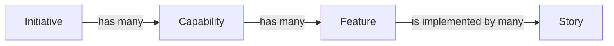

Given the project's initial informal proposal, it is clearly a 'Product Development Project' (in contrast to the more common 'Client Delivery Project'). This type of project is similar to the main product sold by OpenML to it's customers so the company is adept to it's quirks.

## Project Scoping Meetings

To kick off the Scoping Phase of the project it is crucial to arrange up Project Scoping Meetings to gather necessary information and produce initial deliverables.

Given the nature of the project there are no clients to involve in the Scoping Meetings, so the participants are 'internal' to the company.

The expected deliverables expected to be produced at the end of the meetings are:

- List of Conditions of Satisfaction (CoS)
- Requirements Definition
- Choice of PMLC Model to adopt
- Project Overview Statement (POS)

### Meetings Details

Given the high man/hour cost of meetings, two possible approaches are considered to minimize time investment:

- Many meetings with different participants, with the goal of grouping participants with similar schedules and expertise, minimizing scheduling conflicts
- Few meetings with all participants, but with a lower partecipant total, preferring representatives of groups instead of all members

Given the low personnel count of OpenML the second approach is chosen.

The following table lists the participants of the meetings and their roles.

| Name       | Role                        | Reasoning                                             |
|------------|-----------------------------|-------------------------------------------------------|
| A. Tyr     | Project Manager             | The figure selected to eventualy manage the project   |
| B. Saga    | Customer Experience Analyst | Expert representing market concerns and opinions      |
| C. Mimir   | Technical Lead              | Technician representing the eventual development team |
| D. Freyr   | Finance Manager             | Consulting on budgeting aspects of the project        |
| E. Forseti | Legal Advisor               | Ensures legal constraints are considered              |

The Project Manager (PM) will also serve as moderator/facilitator during the meetings.

Given the scope of work (pun intended) to be undertaken during the meetings an initial scheduling of 3 meetings is set, with the possibility of arranging more meetings if necessary.

### Meeting Agenda Template

To aid in the meetings' execution an agenda is used to keep track of the progress.

The following template is used to create the meeting agenda, removing items already completed in previous meetings when necessary.

- Recap of previous meeting

- Introduction of current agenda
- Introduction to the project's inception
- Introduction to project's goal/idea
- Discussion of Conditions of Satisfaction (CoS)
- Production of CoS document
- Discussion of Requirements
- Production of Requirements Definition document
- Choice of PMLC Model
- Draft Project Overview Statement

- Adjurn to next meeting

## Conditions of Satisfaction

In the creation of the CoS document, particular enphasis on the security aspects is put as it is a key feature of the Tyr Framework.

1. Quantitative
    1. Core
        1. Model convergence time to be less than 2x of the centralized baseline
        1. Maximum supported peers in a single federation to be more than 25 organizations
        1. Model to converge to baseline accuracy within less than 5x epochs, respect to the number of epochs of the baseline
    1. Security
        1. Zero raw data transmission between peers
        1. Implemented model encryption and secure aggregation protocols
        1. Multi-factor authentication and cryptographic identity verification for all peers
        1. Zero data leakage verified via privacy audit and attack simulation.
    1. Technical
        1. Client onboarding time less than 4 hours for technical team
        1. 100% of API endpoints to be documented
1. Qualitative
    1. Security
        1. Formal privacy guarantees demonstrated and documented by the research team.
        1. Comprehensive logging of all federation activities accessible to all participants
        1. Clear visibility into aggregation processes without revealing private data
        1. Framework design approved by regional legal counsels for data protection regulations
    1. User Experience
        1. Streamlined process for new organizations to join federations
        1. Intuitive interface for managing multiple federated models
        1. Real-time visibility into training progress and federation health
        1. Comprehensive guides for technical teams and business stakeholders
    1. Business Value
        1. Framework capabilities demonstrably superior to existing open-source solutions
        1. Clear path to monetization through SaaS model

## Requirements Definition

Two ways of expressing requirements are considered:

- Requirements Breakdown Structure (RBS)
- User Stories

RBS has many advantages over User Stories:

- Usually more formal and less subject to misunderstanding
- Being a more traditional approach it is better documented and partecipants might be more use to them
- Understandable hierarchical structure

Most of the strenghts of RBS are considered to be less apparent when the partecipants are entirely internal to OpenML:

- Being an 'internal project' the risk (as in the product of the probability and recovery cost) of misunderstandings is lower
- The team is used to using User Stories as many members, as the company itself, are young and adept to modern approaches
- A hierarchical structure can be imposed with little effort to User Stories too

For these reasons the User Stories apprach is chosen to represent project Requirements

### User Stories

To organizer User Stories into a hierarchical structure the following concepts are used:

#### 1. Client Onboarding and Support

##### 1.1 Documentation

###### 1.1.1 Offer Catalog

###### 1.1.2 Installation Documentation

###### 1.1.3 Framework Documentation

##### 1.2 Installation

###### 1.2.1 Installation Process

###### 1.2.2 Subscription Check

##### 1.3 Help Desk

###### 1.3.1 Onboarding Technical Support

###### 1.3.2 Installation Technical Support

###### 1.3.3 Framework Technical Support

#### 2. Model Definition

##### 2.1 Model Input

###### 2.1.1 Input Schema Definition

###### 2.1.2 Data Preprocessing Interface

###### 2.1.3 Input Validation and Versioning

##### 2.2 Model Layers

###### 2.2.1 Layer Configuration Interface

###### 2.2.2 Supported Architectures Library

###### 2.2.3 Model Architecture Validation

###### 2.2.4 Custom Layer Support

##### 2.3 Model Output

###### 2.3.1 Output Schema Definition

###### 2.3.1 Export and Serialization 

###### 2.3.1 Evaluation and Metrics Interface

#### 3. Federated Learning (Framework Usage)

##### 3.1 Federation Members

###### 3.1.1 Peer Registration System

###### 3.1.2 Role Management

###### 3.1.3 Access Control and Permissions

###### 3.1.4 Membership Lifecycle Management

##### 3.2 Comunication Protocol

###### 3.2.1 Secure Communication Layer

###### 3.2.2 Message Serialization and Compression

###### 3.2.3 Fault Tolerance and Retry Mechanisms

###### 3.2.4 Audit Logging

##### 3.3 Model Training

###### 3.3.1 Training Orchestration Engine

###### 3.3.2 Aggregation Strategy Module

###### 3.3.3 Progress Monitoring and Visualization

###### 3.3.4 Error Handling and Recovery

#### 4. Model Usage

##### 4.1 Model Storage

###### 4.1.1 Version Control System

###### 4.1.2 Access Control for Models

###### 4.1.3 Integrity Verification

##### 4.2 Model Inference

###### 4.2.1 Inference API

###### 4.2.2 Edge Deployment Support

###### 4.2.3 Performance Monitoring

###### 4.2.4 Model Update Mechanism

## PMLC Model Choice

OpenML is no stranger to Agile developing frameworks and managing projects centered on cutting edge technology. Still, the project manager recognizes the advantages of traditional project management life cycles.

The two main approaches considered are Agile and Traditional (Waterfall).

The Tyr Framework project has many characteristics to consider when choosing the PMLC model:

- Agile:
    - Pros:
        - Machine Learining in the modern sense is still a pretty untreaded field. Revolutionary advancements in the state of the art could happen any day and client expectations can vary deeply as the technology matures.
        - A possible approach would be to initially develop the project only internally with possibly not a big involvement from clients untill later in the project life cycle. An Agile approach would enable sharp and quick updates to the requirements as client feedback is gathered.
    - Cons:
        - Bigger planning overhead.
        - Higher scope controll necessary to keep scope creep in check.
        - Possibilty of client involvement disabeling cutting edge explorations due to lack of vision.
- Traditional:
    - Pros:
        - Clear requirements defined in advance.
        - Definitive planning enables a more efficient usage of resources.
    - Cons:
        - Higher cost of scope updates.
        - Higher chance of client unsatisfaction or product's market failure.

Given the pros and cons considered, a hybrid approach is choosen (iterative) TODO refine this

## Project Overview Statement

### Opportunity

### Goal

### Objectives

### Success Criteria

### A/R/O

#### Assuptions

#### Risks

#### Obstacles

### SWAT Analysis

#### Strenghts

#### Weaknesses

#### Opportunities

#### Threats
